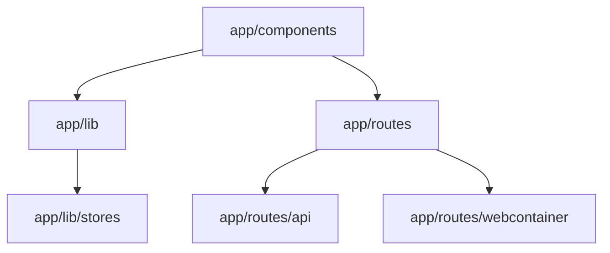
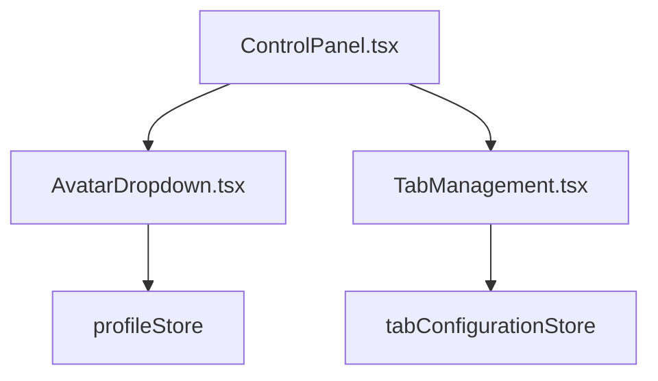
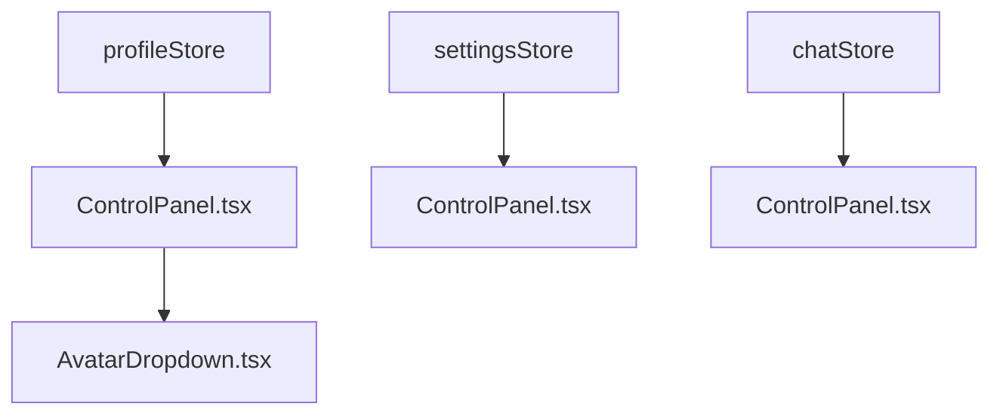
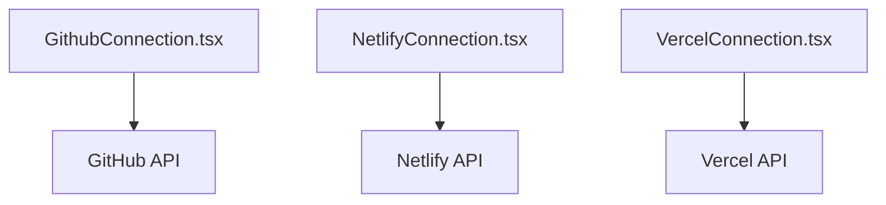
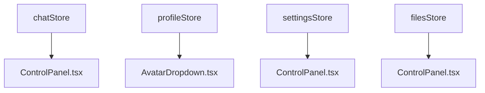

# dtecho/github-v3cvsp36

## Description

This project is designed to provide a comprehensive overview of the project structure, component hierarchy, data flow, API interactions, and state management.

## Installation

To install and set up the project locally, follow these steps:

1. Clone the repository:
   ```sh
   git clone https://github.com/dtecho/github-v3cvsp36.git
   ```
2. Navigate to the project directory:
   ```sh
   cd github-v3cvsp36
   ```
3. Install the dependencies:
   ```sh
   npm install
   ```
4. Start the development server:
   ```sh
   npm start
   ```

## Usage

To use the project, follow these steps:

1. Open your browser and navigate to `http://localhost:3000`.
2. Explore the various features and functionalities provided by the project.

## Configuration

To configure the project, you can modify the following environment variables and settings:

- `API_KEY`: Your API key for accessing external services.
- `DATABASE_URL`: The URL of your database.
- `PORT`: The port on which the server will run.

## Contributing

We welcome contributions to the project. To contribute, follow these steps:

1. Fork the repository.
2. Create a new branch for your feature or bugfix:
   ```sh
   git checkout -b my-feature-branch
   ```
3. Make your changes and commit them:
   ```sh
   git commit -m "Add new feature"
   ```
4. Push your changes to your forked repository:
   ```sh
   git push origin my-feature-branch
   ```
5. Create a pull request to the main repository.

## License

This project is licensed under the MIT License. See the [LICENSE](LICENSE) file for more information.

## Acknowledgements

We would like to thank the following third-party resources and contributors:

- [React](https://reactjs.org/)
- [Framer Motion](https://www.framer.com/motion/)
- [Radix UI](https://www.radix-ui.com/)

## Contact

For any questions or support, please contact the maintainers at [support@example.com](mailto:support@example.com).

## Project Structure



## Component Hierarchy



## Data Flow



## API Interactions



## State Management


